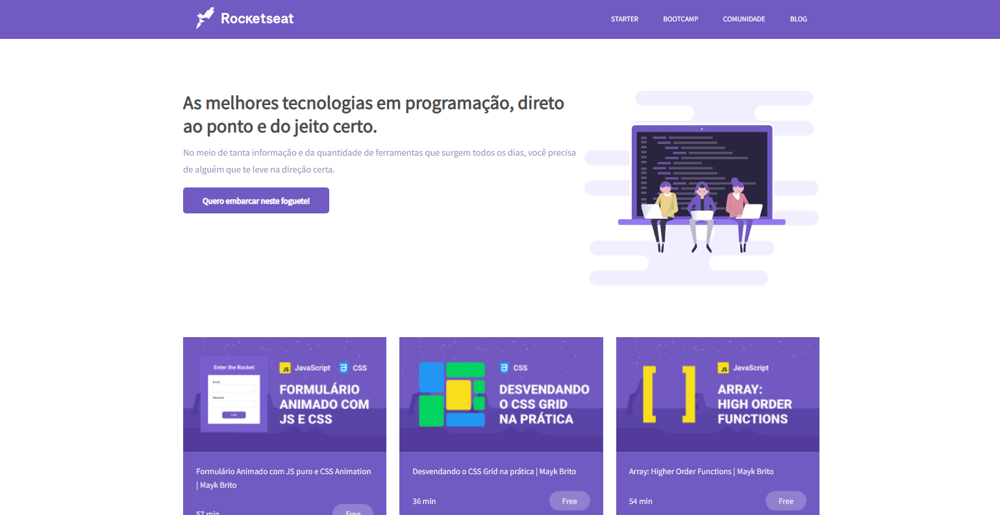

<h1 align="center">💜 ROCKETSEAT PAGE</h1>

> 🔎 Uma página da Rocketseat feita com Sass

🗔 Confira a aplicação: https://kayke-fujinaka.github.io/Rocketseat-Page/  

## 🚀 Tecnologias ##

- [HTML](https://developer.mozilla.org/pt-BR/docs/Web/HTML)
- [JavaScript](https://developer.mozilla.org/pt-BR/docs/Web/JavaScript)
- [SASS](https://sass-lang.com/documentation)

## 🤝 Colaboradores

Agradecemos às seguintes pessoas que contribuíram para este projeto:

<table>
  <tr>
    <td align="center">
      <a href="#">
         
        
          <b>Kayke Fujinaka</b>
        
      </a>
    </td>
  </tr>
</table>

## 📝 Licença

Este projeto está sob licença. Consulte o arquivo [LICENSE](LICENSE.md) para obter mais detalhes.

&#xa0;

<a href="#top">Volte para o topo</a>